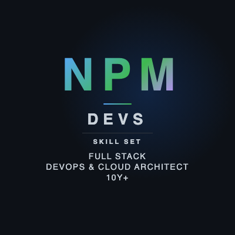

# NPM Devs

**Full Stack · DevOps & Cloud Architect · 10y+**

Hello! Thank you for visiting our profile.

We are NPM Devs — Nhi, Phong & My — a team of engineers with 10+ years of experience delivering production-ready solutions across DevOps & Cloud Infrastructure, Blockchain Systems, and Full-Stack Web3 Development. We take full ownership of every project, from requirements and system design through to deployment and monitoring.

---

## Team Members

### Nhi Le — Tech Lead

Tech Lead & Architect across blockchain and cloud domains. Designs scalable AWS & Kubernetes architectures, leads RPC node & validator infrastructure, maintains PCI DSS compliance, and drives end-to-end delivery — from requirements to production.

`System Design` `Architecture` `AWS` `Kubernetes` `Blockchain Infra` `PCI DSS` `Tech Lead` `Project Mgmt`

---

### My Tran — DevOps & AWS Professional

DevOps & Cloud Infrastructure on AWS. Landing Zone, multi-account governance, on-prem migration, Kubernetes, Terraform, Ansible. CI/CD pipelines across GitLab, GitHub Actions, Jenkins, AWS CodePipeline.

`AWS` `Landing Zone` `Terraform` `Ansible` `Kubernetes` `DevOps` `Migration`

---

### Phong Ho — Talent Fullstack Developer

Web3 & Full-stack development. Smart contracts (Solidity), dApp engineering (ReactJS + NestJS), CEX wallet systems, DePIN, NFT platforms & microservices.

`Full Stack` `Solidity` `Web3` `NestJS` `ReactJS` `NFT / DeFi`

---

## What We Deliver

### DevOps & Cloud Infrastructure
- **AWS**: EC2, ECS, VPC, RDS, S3, Lambda, WAF, ALB, KMS, Nitro Enclaves
- **AWS Well-Architected Framework**, Landing Zone: multi-account governance, security baseline, on-prem → cloud migration
- **Kubernetes** (HA, from scratch), Docker, Helm, Traefik, Cilium, KCL, Rancher
- **IaC**: Terraform, Ansible, CloudFormation
- **CI/CD**: GitHub Actions, GitLab CI, Jenkins, AWS CodePipeline, ArgoCD, GitOps
- **Monitoring**: Prometheus, Grafana, Loki, ELK Stack
- Linux server administration, SonarQube (code quality)

### Blockchain Infrastructure
- **RPC Nodes**: ETH & BTC — high availability & scalability
- **CEX Wallet Systems**: multi-chain, KMS & Nitro Enclaves
- **Payment Platforms**: PCI DSS-compliant, Google Pay & Apple Pay
- **Validator Monitoring**: metrics, health checks, real-time alerts
- **Trading Systems**: order matching, market maker BOT, FIX Protocol

### Smart Contracts & dApps
- **Solidity**: DeFi, NFT, DAO, DePIN platforms
- **Full-Stack**: ReactJS, NextJS, NestJS, IPFS
- **Architecture**: event-driven microservices, Kafka

### Web Development
- **Frontend**: ReactJS, NextJS, HTML, CSS, TailwindCSS
- **Backend**: NodeJS, NestJS, Java, Spring Boot, Spring Cloud, REST APIs, WebSocket
- CMS integration & third-party API integration

### Bot Development
- Telegram Bots, Discord Bots
- Trading Bots & Market Maker automation
- Workflow automation with Python & Bash scripting

### Crawler & Scraping
- Web crawlers & scrapers: Python (Scrapy, BeautifulSoup, Playwright)
- NodeJS-based crawlers
- Data pipeline automation & scheduled jobs

### Security & Compliance
- **Standards**: PCI DSS, WAF hardening, TLS/HTTPS
- **Tools**: OAuth2 Proxy, Keycloak, cert-manager, Sealed Secrets, Cilium Network Policies

### Backend & Databases
- **Backend**: Java, Spring Boot, Spring Cloud, NodeJS, NestJS, REST APIs
- **Databases**: MySQL, PostgreSQL, MSSQL, Oracle, MongoDB, Redis
- **Messaging**: Kafka, RocketMQ, Zookeeper, Consul

### Languages
- JavaScript, TypeScript, Java, Python, Solidity, Rust, Bash, .NET

### Project Management
- Scrum / Agile, scope definition, task breakdown, risk management
- Direct client communication, technical documentation, team mentoring

---

~4 hrs/day per person · Available for freelance projects
