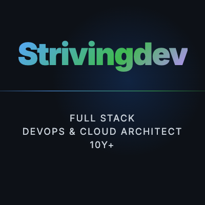

# Strivingdev

**Free Consultation - Solutions Architect - DevOps - 10y**

Not sure what you need yet? That's exactly where we start — reach out, it's free.

I lead Strivingdev, a team of experienced engineers focused on one thing: delivering the right solution at the right cost — not the most complex one, not the most expensive one.

Before we write a single line of code, we talk. We take time to understand your problem, explore the options, and agree on a direction that actually makes sense for your context. That clarity upfront is what makes the delivery reliable.

If you're dealing with a technical problem — whether it's infrastructure, a product you need to build, a system that's breaking, or something you haven't been able to put into words yet — reach out. We'll figure it out together. No commitment until we both understand what needs to be done.

I'm happy to consult for free. Once the scope is clear, we can move forward on a foundation of mutual trust and shared understanding.

Below are the areas where we operate:

▌ DevOps & Cloud Infrastructure
• AWS: EC2, ECS, VPC, RDS, S3, Lambda, WAF, ALB, KMS, Nitro Enclaves
• Landing Zone: multi-account governance, security baseline, on-prem → cloud migration
• Kubernetes, Docker, Helm, Traefik, Cilium, Rancher
• IaC: Terraform, Ansible, CloudFormation
• CI/CD: GitHub Actions, GitLab CI, Jenkins, ArgoCD, GitOps
• Monitoring: Prometheus, Grafana, Loki, ELK Stack

▌ Blockchain Infrastructure
• RPC Nodes (ETH, BTC), CEX Wallet Systems, KMS & Nitro Enclaves
• Payment Platforms: PCI DSS-compliant, Google Pay & Apple Pay
• Validator Monitoring, Trading Systems, market maker BOT, FIX Protocol

▌ Smart Contracts & dApps
• Solidity: DeFi, NFT, DAO, DePIN platforms
• Full-Stack: ReactJS, NextJS, NestJS, IPFS
• Architecture: event-driven microservices, Kafka

▌ Web Development
• Frontend: ReactJS, NextJS, HTML, CSS, TailwindCSS
• Backend: NodeJS, NestJS, Java, Spring Boot, REST APIs, WebSocket
• CMS integration & third-party API integration

▌ Bot & Automation
• Telegram Bots, Discord Bots, Trading Bots & Market Maker automation
• Web crawlers: Python (Scrapy, BeautifulSoup, Playwright), NodeJS
• Workflow automation & data pipelines (Python, Bash)

▌ Security & Compliance
• PCI DSS, WAF, TLS/HTTPS
• OAuth2 Proxy, Keycloak, cert-manager, Sealed Secrets, Cilium Network Policies

▌ Backend & Databases
• Java, Spring Boot, NodeJS, NestJS, REST APIs
• MySQL, PostgreSQL, MSSQL, Oracle, MongoDB, Redis
• Kafka, RocketMQ, Zookeeper, Consul

---

## Team Members

### Nhi Le — Tech Lead

Tech Lead & Architect across blockchain and cloud domains. Designs scalable AWS & Kubernetes architectures, leads RPC node & validator infrastructure, maintains PCI DSS compliance, and drives end-to-end delivery — from requirements to production.

`System Design` `Architecture` `AWS` `Kubernetes` `Blockchain Infra` `PCI DSS` `Tech Lead` `Project Mgmt`

---

### My Tran — DevOps & AWS Professional

DevOps & Cloud Infrastructure on AWS. Landing Zone, multi-account governance, on-prem migration, Kubernetes, Terraform, Ansible. CI/CD pipelines across GitLab, GitHub Actions, Jenkins, AWS CodePipeline.

`AWS` `Landing Zone` `Terraform` `Ansible` `Kubernetes` `DevOps` `Migration`

---

### Phong Ho — Talent Fullstack Developer

Web3 & Full-stack development. Smart contracts (Solidity), dApp engineering (ReactJS + NestJS), CEX wallet systems, DePIN, NFT platforms & microservices.

`Full Stack` `Solidity` `Web3` `NestJS` `ReactJS` `NFT / DeFi`
